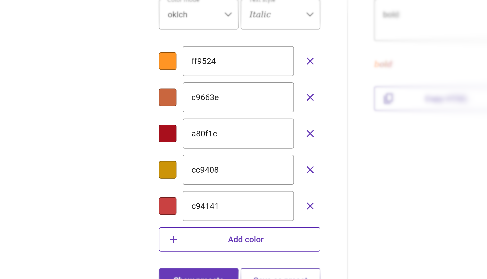
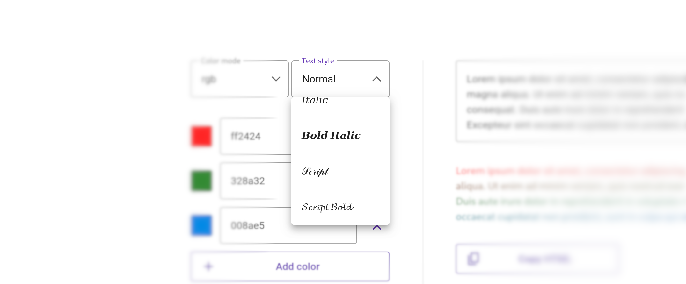
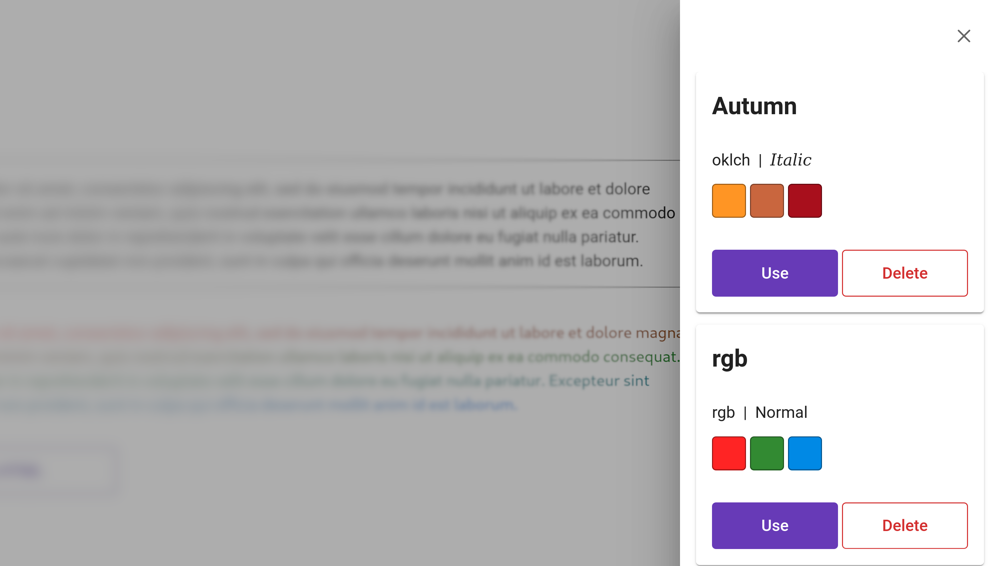

# Text gradientify


Create HTML text gradients with ease.

## Unlimited color transitions



Use any number of colours.

## Text modes



Are you a 𝐛𝐨𝐥𝐝 person? Or maybe someone more 𝑖𝑡𝑎𝑙𝑖𝑐? There are different text modes you can choose from.

## Locally saved presets



You can save your configurations and load them from a list. The list persists even after a page refresh.

## Running locally

1. Clone the project.

   ```
   git clone https://github.com/mitonik/text-gradientify
   ```

2. Install dependancies.

   ```
   npm install
   ```

3. Build the project.

   ```
   npm run build
   ```

4. Start a preview server.

   ```
   npm run preview
   ```

5. Go to http://localhost:4173/text-gradientify/.
